# 🎮 Videogames API

REST API for managing videogames, built with pure Go (`net/http`) and PostgreSQL. No external frameworks — just Go's standard library and `pgx` as the database driver.

---

## 📁 Project Structure

```
videogames-api/
├── main.go                        # Entry point
├── go.mod                         # Dependencies
├── go.sum                         # Dependency verification
├── .env                           # Environment variables (not committed to git)
├── .gitignore
├── docker-compose.yml             # Container orchestration
├── config/
│   └── db.go                      # PostgreSQL connection
├── server/
│   └── server.go                  # Server setup and routes
├── internal/
│   └── videogames/
│       ├── model.go               # Structs and validations
│       ├── errors.go              # Domain errors
│       ├── repository.go          # SQL queries
│       ├── service.go             # Business logic
│       └── handler.go             # HTTP handlers
├── docker/
│   ├── api.Dockerfile             # API image
│   └── postgres.Dockerfile        # PostgreSQL image
└── scripts/
    └── init.sql                   # Database initialization script
```

---

## ⚙️ Environment Variables

Create a `.env` file at the root of the project:

```env
DB_USER=postgres
DB_PASS=postgres
DB_HOST=localhost
DB_PORT=5432
DB_NAME=gamecenter
```

> ⚠️ When using Docker, `DB_HOST` is automatically overridden to `postgres` by `docker-compose.yml`.

---

## 🚀 How to Run

### With Docker (recommended)

```bash
# Start everything (API + PostgreSQL)
docker-compose up --build

# Run in background
docker-compose up --build -d

# View logs
docker-compose logs -f

# Stop containers
docker-compose down

# Stop and delete data
docker-compose down -v
```

### Without Docker (local)

Make sure PostgreSQL is running and the database is created, then:

```bash
go mod tidy
go run .
```

---

## 📡 Endpoints

Base URL: `http://localhost:24484`

### Ping

| Method | Route | Description |
|--------|-------|-------------|
| GET | `/api` | Check if the server is running |

**Response:**
```json
{
  "message": "I'm Alive 😁"
}
```
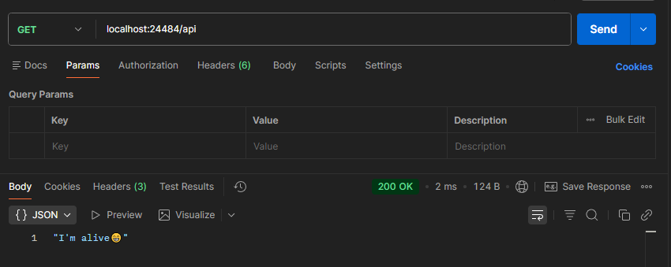
---

### Videogames

| Method | Route | Description |
|--------|-------|-------------|
| GET | `/api/videogames` | List all videogames |
| GET | `/api/videogames/{id}` | Get a videogame by ID |
| POST | `/api/videogames` | Create a new videogame |
| PUT | `/api/videogames/{id}` | Fully update a videogame |
| DELETE | `/api/videogames/{id}` | Delete a videogame |

---

## 📋 Usage Examples

### GET /api/videogames

List all videogames.

```bash
curl http://localhost:24484/api/videogames
```

**Success — 200 OK:**
```json
[
  {
    "id": 1,
    "name": "Fortnite",
    "category": "Battle Royale",
    "active_players": 5000000,
    "size": 30.5,
    "rating": 9,
    "downloads": 400000000
  },
  {
    "id": 2,
    "name": "Minecraft",
    "category": "Sandbox",
    "active_players": 3000000,
    "size": 1.2,
    "rating": 10,
    "downloads": 238000000
  }
]
```
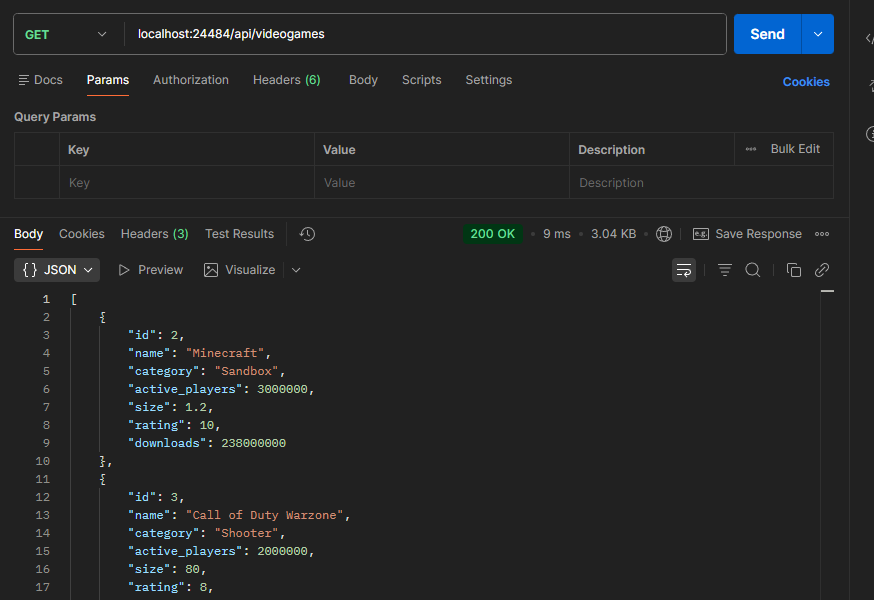
---

### GET /api/videogames/{id}

Get a videogame by its ID.

```bash
curl http://localhost:24484/api/videogames/1
```

**Success — 200 OK:**
```json
{
  "id": 1,
  "name": "Fortnite",
  "category": "Battle Royale",
  "active_players": 5000000,
  "size": 30.5,
  "rating": 9,
  "downloads": 400000000
}

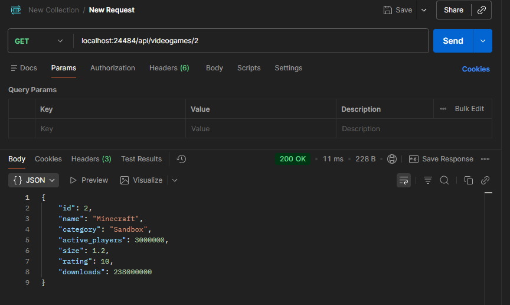
```

**404 Not Found:**
```json
{
  "error": "videogame not found"
}

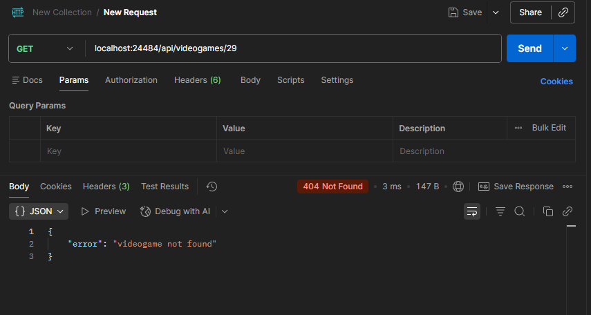
```

**400 Bad Request (invalid ID):**
```json
{
  "error": "invalid id"
}

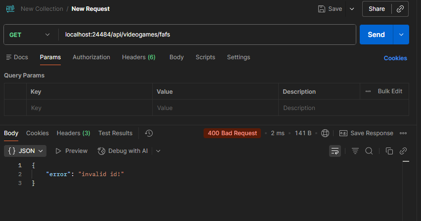
```

---

### POST /api/videogames

Create a new videogame.

```bash
curl -X POST http://localhost:24484/api/videogames \
  -H "Content-Type: application/json" \
  -d '{
    "name": "Zelda Tears of the Kingdom",
    "category": "Adventure",
    "active_players": 800000,
    "size": 16.3,
    "rating": 10,
    "downloads": 20000000
  }'
```

**Request body:**

| Field | Type | Required | Description |
|-------|------|----------|-------------|
| `name` | string | ✅ Yes | Videogame name |
| `category` | string | ✅ Yes | Videogame category |
| `active_players` | int | No | Active players count |
| `size` | float | ✅ Yes | Size in GB |
| `rating` | int | No | Rating from 1 to 10 |
| `downloads` | int | No | Total downloads |

**Success — 201 Created:**
```json
{
  "id": 26,
  "name": "Zelda Tears of the Kingdom",
  "category": "Adventure",
  "active_players": 800000,
  "size": 16.3,
  "rating": 10,
  "downloads": 20000000
}

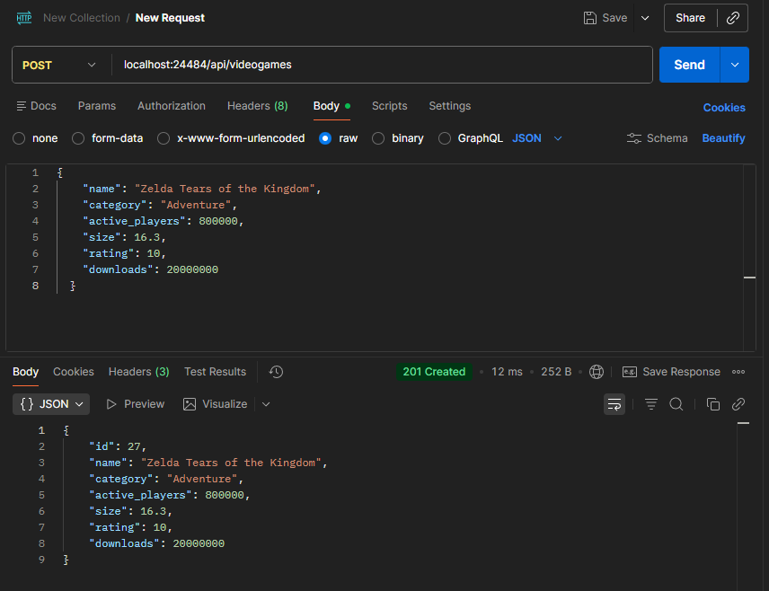
```

**400 Bad Request (missing required fields):**
```json
{
  "error": "name is required"
}
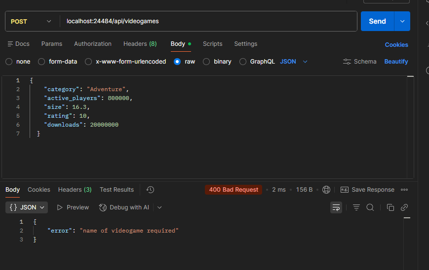
```

---

### PUT /api/videogames/{id}

Fully update a videogame. You must send **all fields**.

```bash
curl -X PUT http://localhost:24484/api/videogames/2 \
  -H "Content-Type: application/json" \
  -d '{
        "name": "Minecraft Java Edition",
        "category": "Sandbox",
        "active_players": 3000000,
        "size": 1.2,
        "rating": 10,
        "downloads": 238000000
    }'
```

**Request body:**

| Field | Type | Description |
|-------|------|-------------|
| `name` | string | Videogame name |
| `category` | string | Videogame category |
| `active_players` | int | Active players count |
| `size` | float | Size in GB |
| `rating` | int | Rating from 1 to 10 |
| `downloads` | int | Total downloads |

**Success — 200 OK:**
```json
{
  "id": 2,
  "name": "Minecraft Java Edition",
  "category": "Sandbox",
  "active_players": 3000000,
  "size": 1.2,
  "rating": 10,
  "downloads": 238000000
}

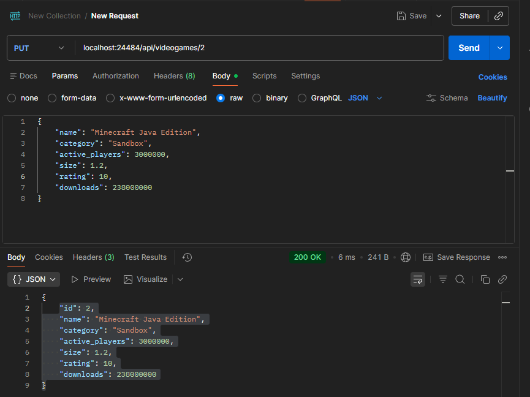
```

**404 Not Found:**
```json
{
  "error": "videogame not found"
}

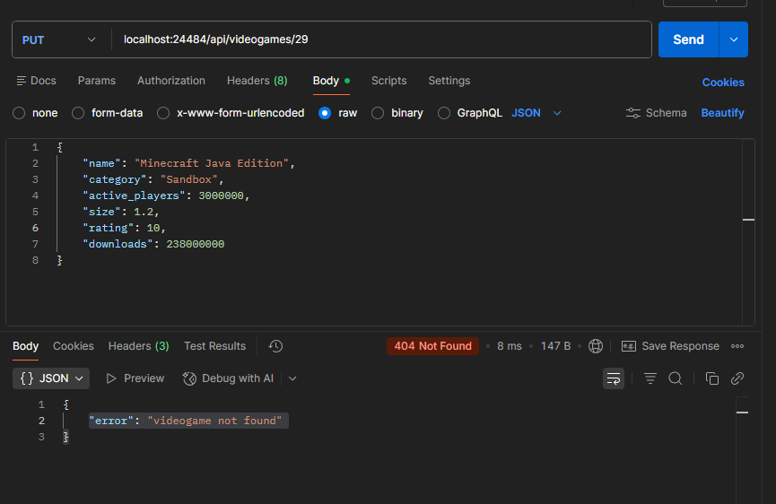
```

---

### DELETE /api/videogames/{id}

Delete a videogame by its ID.

```bash
curl -X DELETE http://localhost:24484/api/videogames/1
```

**Success — 200 OK:**
```json
{
  "message": "videogame deleted"
}

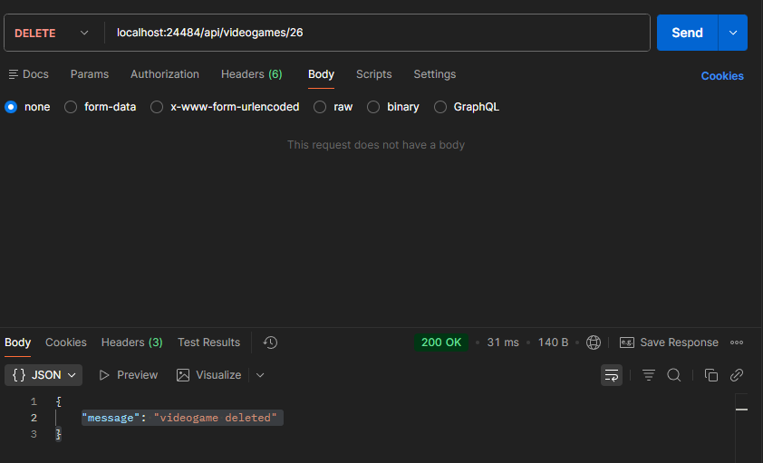
```

**404 Not Found:**
```json
{
  "error": "videogame not found"
}

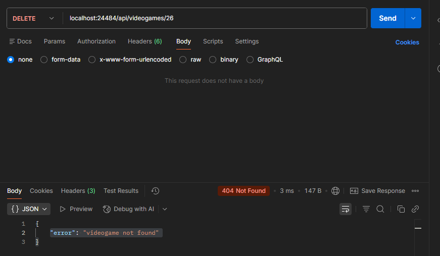
```

---

## ⚠️ Response Codes

| Code | Meaning |
|------|---------|
| 200 | OK — successful operation |
| 201 | Created — resource created successfully |
| 400 | Bad Request — invalid body or malformed ID |
| 404 | Not Found — videogame does not exist |
| 405 | Method Not Allowed — HTTP method not supported |
| 500 | Internal Server Error — server-side error |

---

## 🛠️ Tech Stack

| Technology | Usage |
|-----------|-------|
| Go 1.22 | Main language |
| `net/http` | HTTP server (Go standard library) |
| `pgx/v5` | PostgreSQL driver |
| PostgreSQL 16 | Database |
| Docker | Containers |
| docker-compose | Orchestration |